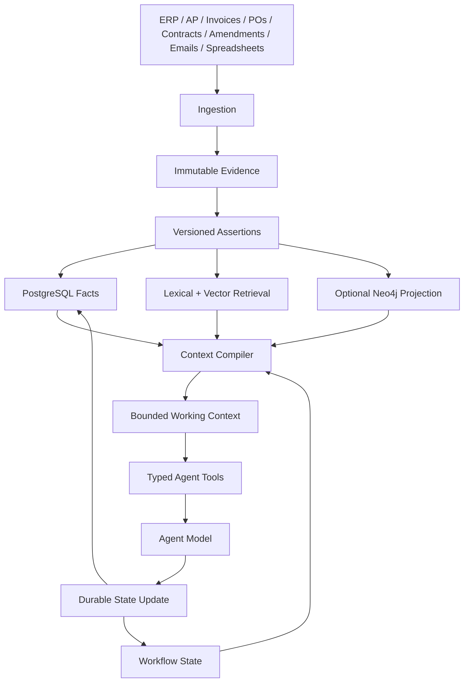

# DD Context Engine

## TL;DR

I built this as a context and memory foundation for a long-running enterprise agent.

The problem I was solving is simple to describe but difficult to implement well: the information an agent needs is not sitting in one document or one prompt. It is spread across ERP records, invoices, purchase orders, contracts, amendments, emails and spreadsheets, and some of that information changes over time.

I did **not** have access to Discover Dollar's internal memory system, private APIs or production data, so I did not try to recreate something I could not see.

Instead, I built the part I could defend from the available evidence:

```text
raw enterprise evidence
        ↓
immutable source + evidence spans
        ↓
versioned assertions with provenance
        ↓
SQL facts + workflow state
        ↓
lexical / semantic / hybrid retrieval
        ↓
context assembly
        ↓
bounded working context
        ↓
agent
        ↓
durable state update
```

The core decision is:

> **I keep durable truth outside the model and make the model consume a small, task-specific working set.**

That gives me a system where the model can reason without becoming the database, the audit log, or the source of truth.

---

## The problem I started from

A useful question like:

> "What funding rate applies to this vendor?"

can depend on much more than the latest email.

The system may need to connect a contract, an amendment, an extracted commercial term, the evidence supporting that term, and the current workflow state of the case.

That immediately creates four different kinds of state:

| State               | What I keep there                                    |
| ------------------- | ---------------------------------------------------- |
| **Evidence**        | Source metadata and exact evidence spans             |
| **Business state**  | Canonical claims, validity, provenance, supersession |
| **Workflow state**  | Case progress, retries, checkpoints, approvals       |
| **Working context** | Only the information needed for the current task     |

I kept these separate deliberately. A workflow checkpoint should not become a business fact. A model prompt should not become permanent memory. A graph should not silently become financial truth.

---

## How I got to this design

I used the research to answer specific engineering questions rather than copy architectures from papers.

### MemGPT — where should long-term state live?

[MemGPT](https://arxiv.org/abs/2310.08560) gave me the starting point: the model's immediate context should not be treated as the whole memory system.

That led me to move durable state into persistence and make context something assembled for a task.

### Generative Agents — how should relevant memory be brought back?

[Generative Agents](https://arxiv.org/abs/2304.03442) reinforced the retrieval side of the design: do not replay an entire history every time the agent reasons.

I applied that idea to enterprise data by building:

```text
PostgreSQL lexical retrieval
        +
pgvector semantic retrieval
        ↓
hybrid ranking with Reciprocal Rank Fusion
        ↓
context compiler
```

The important part is not just having search. Retrieval happens before context compilation, so the model sees a bounded working set rather than an ever-growing history.

### CoALA — what belongs inside the agent and what does not?

[CoALA](https://arxiv.org/abs/2309.02427) helped me separate memory, actions and reasoning.

That became a concrete boundary in this project:

```text
memory / facts / evidence  →  persistence
workflow                    →  durable workflow state
retrieval                   →  retrieval layer
reasoning                   →  model
actions                     →  typed agent tools
```

That separation makes it possible to replace the model, retrieval backend or extraction model without rewriting the underlying state model.

### Mem0 — should memory and graph be treated as magic?

[Mem0](https://arxiv.org/abs/2504.19413) was useful mainly because it made me more conservative.

The results support selective persistent memory, but the graph results are not strong enough to justify making a graph authoritative for every question.

So I made the graph **optional and derived**.

That means:

```text
Postgres + evidence
        ↓
authoritative state

Neo4j
        ↓
relationship retrieval / traversal
```

The graph can help answer relationship-heavy questions without becoming the place where financial truth lives.

These papers support the direction of the architecture. They do not prove that the same numbers will hold for Discover Dollar's workload, so I have kept that boundary explicit.

---

## Why I version assertions instead of overwriting facts

This was one of the first places where a toy implementation would fall apart.

Suppose I extract:

```text
Jan 2026
funding_rate = 10%
```

and later receive an amendment:

```text
Apr 2026
funding_rate = 12%
```

I do not turn `10%` into `12%`.

I keep both assertions and record the relationship between them:

```text
assertion
├── valid_from / valid_to
├── recorded_at
├── status
├── source_id
├── evidence_span_id
├── extractor_version
└── supersedes_assertion_id
```

Now the system can distinguish:

```text
"What is the current rate?"
from
"What rate was valid in February?"
from
"Which evidence caused the change?"
```

That is much closer to the problem I was actually trying to solve.

---

## Why provenance is part of the data model

I did not want the final answer to depend on the model remembering where something came from.

The chain is explicit:

```text
agent output
      ↓
assertion
      ↓
evidence span
      ↓
source record
      ↓
original document
```

An extracted fact therefore carries enough information to trace it back to evidence.

That also gives the system a clean place to attach extractor/model versions instead of pretending an extraction is timeless.

---

## What makes this more than a toy prototype

I designed the persistence and boundaries around the failure modes I would expect once the data and number of cases grow.



A few examples of the engineering decisions behind that shape:

* Every durable object carries tenant context rather than relying on the caller to remember it.
* Writes are idempotent around stable identifiers so duplicate ingestion does not create duplicate durable state.
* Assertions are transactional so supersession does not corrupt history.
* Context assembly is bounded instead of passing an unbounded collection of retrieved records to the model.
* Retrieval is behind interfaces, so the context layer is not tied to one search implementation.
* PostgreSQL handles durable state and transactions; search is layered onto that state instead of replacing it.
* Neo4j traversal is bounded and tenant-safe, and the graph never becomes authoritative.
* Alembic migrations make the schema reproducible instead of depending on a manually prepared database.
* API integration tests exercise the same paths that connect evidence, embeddings, workflow state and context compilation.

I have not claimed a benchmark at Discover Dollar's production scale because I do not have their data or workload.

What I have done is make the architecture capable of growing in the right dimensions without forcing the model to carry the entire enterprise state in its context window.

---

## What I actually built

The repository now contains:

```text
Evidence ingestion
    → source metadata
    → evidence spans
    → deterministic email threading

Business state
    → canonical assertions
    → temporal validity
    → supersession
    → provenance
    → extractor/model version tracking

Workflow
    → durable case state
    → checkpoints
    → retries
    → pending/completed steps

Retrieval
    → PostgreSQL lexical search
    → pgvector semantic search
    → hybrid RRF retrieval

Context
    → task-aware retrieval
    → conflict handling
    → bounded context compilation

Graph
    → optional Neo4j relationship traversal
    → derived, tenant-safe and depth-bounded

Runtime
    → workflow GET/PUT
    → evidence endpoints
    → embedding endpoint
    → context compilation API

Engineering
    → Alembic migrations
    → integration tests
    → repository interfaces
    → linting
```

The current test suite passes with:

```text
19 passed
Ruff: all checks passed
Alembic: migrations applied successfully
```

---

## The boundary I am defending

This repository is **not** Discover Dollar's private implementation, and it is not a financial audit engine.

It is the part of the system I can justify from the available problem definition:

```text
enterprise evidence
        ↓
durable, versioned state
        ↓
retrieval
        ↓
controlled context
        ↓
agent reasoning
```

That is the design I chose because it gives the agent persistent memory without making the model responsible for persistence, provenance, temporal truth, workflow recovery or the entire enterprise history.
