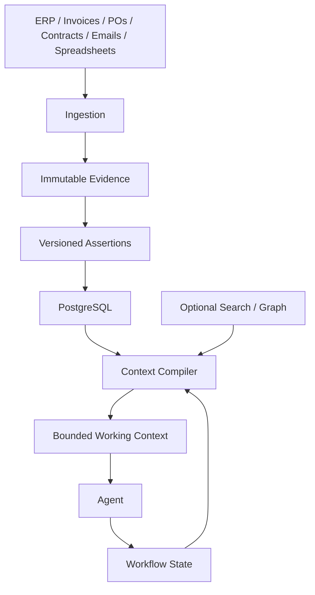

# DD Context Engine

A small backend for giving long-running enterprise AI agents **durable memory, evidence, workflow state, and controlled working context**.

## TL;DR

Enterprise data is spread across ERP records, invoices, contracts, spreadsheets, emails, and amendments. A model cannot reliably keep all of that in its prompt.

So this project keeps the durable state **outside the model**:

```text
raw evidence
    ↓
versioned assertions + provenance
    ↓
PostgreSQL workflow / business state
    ↓
context assembly
    ↓
small working context
    ↓
agent
```

The important decision is simple:

> **The LLM is the reasoning layer, not the database.**

Everything durable needs an identity, tenant boundary, provenance, and, where necessary, temporal validity.

---

## What we are building



### Four kinds of state

| State               | What it contains                                     |
| ------------------- | ---------------------------------------------------- |
| **Evidence**        | Original source metadata and evidence spans          |
| **Business state**  | Extracted claims, validity, provenance, supersession |
| **Workflow state**  | Case progress, retries, checkpoints, approvals       |
| **Working context** | Small task-specific data sent to the model           |

They are deliberately kept separate.

---

## Why this design?

### Durable memory instead of full history

MemGPT showed the value of moving information outside the model's immediate context rather than treating the context window as permanent memory.

[MemGPT](https://arxiv.org/abs/2310.08560)

### Retrieval instead of replaying everything

Generative Agents used a memory stream plus retrieval and higher-level reflections rather than repeatedly supplying an entire history.

[Generative Agents](https://arxiv.org/abs/2304.03442)

### Separate memory, actions, and reasoning

CoALA provides a useful architectural separation between memory, actions, and the agent decision process.

[CoALA](https://arxiv.org/abs/2309.02427)

### Selective persistent memory

Mem0 provides experimental evidence that selective persistent memory can be substantially cheaper and faster than repeatedly processing the full conversation history.

[Mem0](https://arxiv.org/abs/2504.19413)

These papers support the **direction** of the design. They do not prove that their benchmark numbers transfer directly to enterprise financial workloads.

---

## Why assertions are versioned

A commercial term can change.

For example:

```text
Jan 2026
funding_rate = 10%

Apr 2026 amendment
funding_rate = 12%
```

The system should not simply overwrite `10%`.

Instead, both assertions can exist with:

```text
valid_from
valid_to
recorded_at
status
source_id
evidence_span_id
extractor_version
supersedes_assertion_id
```

That lets the system answer questions about **what was true at a particular time**.

---

## Why provenance matters

An extracted assertion should be traceable:

```text
agent output
    ↓
assertion
    ↓
evidence span
    ↓
source record
    ↓
original document
```

The model should not be the thing that invents or reconstructs that chain.

---

## Why the graph is optional

The graph is useful for relationship traversal:

```text
Vendor
  ↓
Contract
  ↓
Amendment
  ↓
Commercial Term
  ↓
Invoice
```

But the graph is deliberately **derived**, not authoritative.

The authoritative state remains in the structured persistence layer and immutable evidence.

Mem0's own results do not establish that graph memory is universally better, so graph usage remains an implementation choice that should be validated against the workload.

---

## Current implementation

The repository currently contains:

* PostgreSQL persistence
* immutable evidence metadata
* evidence spans
* versioned commercial assertions
* temporal validity
* provenance fields
* durable workflow state
* deterministic email threading / ingestion
* bounded context assembly
* optional Neo4j relationship retrieval
* Alembic migrations
* API integration tests
* PostgreSQL integration tests
* deployment skeleton

---

## What this is not

This is **not**:

* Discover Dollar's private implementation
* a financial audit rules engine
* an autonomous financial decision maker
* proof that a specific memory architecture is universally optimal

It is the **memory + evidence + workflow + context layer** that an agent can build on.

---

## Project structure

```text
src/dd_context_engine/
├── api/
├── context/
├── domain/
├── graph/
├── ingestion/
└── storage/

tests/
alembic/
deploy/

ARCHITECTURE.md
RESEARCH_AUDIT.md
README.md
```

## Run

```powershell
python -m pytest -q
python -m ruff check src tests
alembic upgrade head
```

## The core idea

```text
Durable enterprise state
        ↓
retrieve what matters
        ↓
compile a small working set
        ↓
let the model reason
        ↓
persist the result / checkpoint
```

That is the foundation this project is building.
